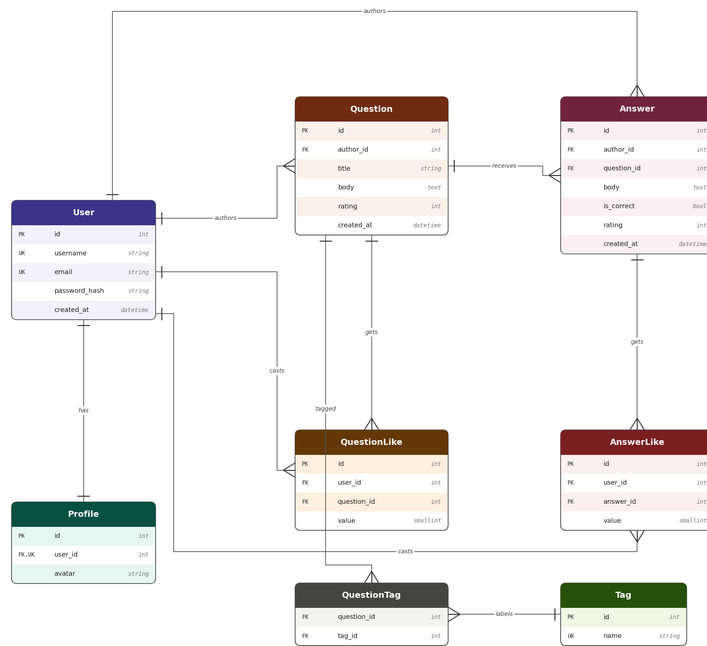

# 2026-VK-EDU-Web-13-Kuznetsov-S

AskPupkin — учебный Django-проект (Q&A сайт), разделён на приложения `core` и `questions`.

## Схема базы данных



## Требования

- Python 3.10+
- PostgreSQL 14+

## Локальный запуск

### 1. Клонировать репозиторий и создать виртуальное окружение

```bash
python -m venv venv
# Windows
venv\Scripts\activate
# macOS/Linux
source venv/bin/activate
```

### 2. Установить зависимости

```bash
pip install -r requirements.txt
```

### 3. Настроить PostgreSQL

Создайте базу данных и пользователя (или используйте существующего):

```sql
CREATE DATABASE askme;
-- если нужно создать пользователя:
CREATE USER postgres WITH PASSWORD 'ваш_пароль';
GRANT ALL PRIVILEGES ON DATABASE askme TO postgres;
```

### 4. Создать файл `.env.local`

Скопируйте пример и заполните своими данными:

```bash
cp .env.example .env.local
```

Отредактируйте `.env.local`:

```
DJANGO_SECRET_KEY=любая-случайная-строка
DJANGO_DEBUG=True
DJANGO_ALLOWED_HOSTS=127.0.0.1,localhost
DB_NAME=askme
DB_USER=postgres
DB_PASSWORD=ваш_пароль
DB_HOST=localhost
DB_PORT=5432
```

### 5. Применить миграции

```bash
python manage.py migrate
```

### 6. Создать суперпользователя (для доступа к /admin/)

```bash
python manage.py createsuperuser
```

### 7. Наполнить базу тестовыми данными (опционально)

```bash
python manage.py fill_db 100
```

Где `100` — коэффициент: создаст 100 пользователей, 1000 вопросов, 10 000 ответов и т.д.

### 8. Запустить сервер

```bash
python manage.py runserver
```

Откройте http://127.0.0.1:8000/

## Запуск через Docker Compose

```bash
docker compose up --build
```

После сборки сайт будет доступен по адресу http://127.0.0.1:8000/.

> Для Docker используется файл `.env.docker`. Создайте его по аналогии с `.env.example`, указав `DB_HOST=db`.

## Структура проекта

- `application/` — настройки Django проекта
- `core/` — страницы пользователя: вход, регистрация, профиль
- `questions/` — страницы вопросов: список, теги, подробности, создание вопроса
- `templates/` — HTML-шаблоны
- `public/static/` — статические CSS/JS/картинки
- `media/` — загруженные файлы
